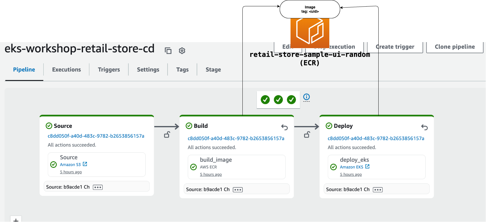
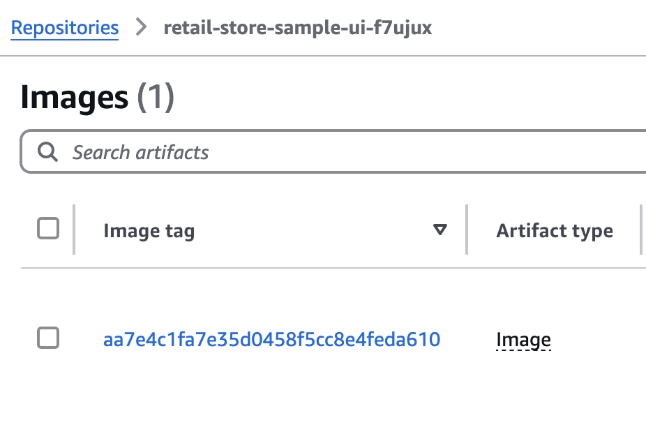
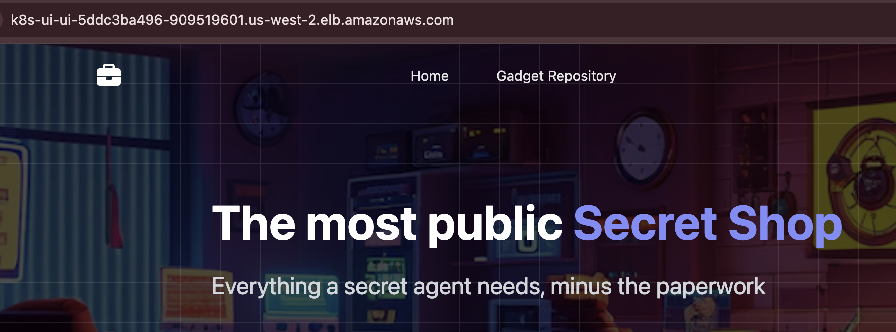
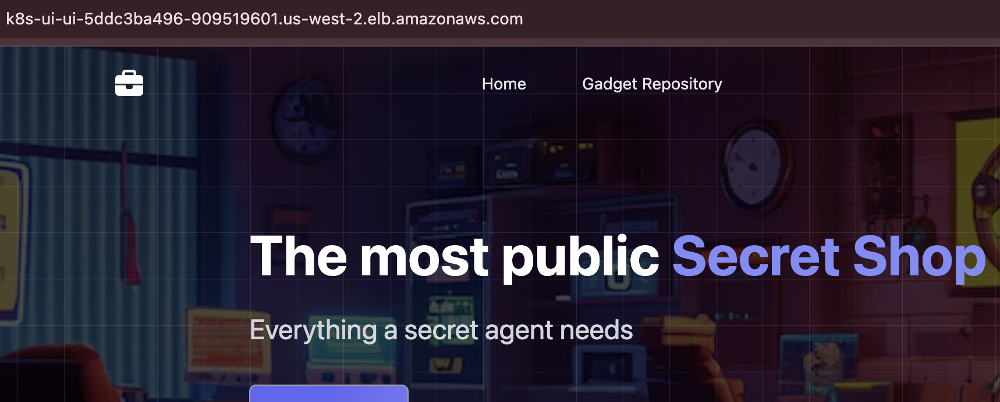

In this module, we will deploy the UI component using retail-store-sample-app with a CodePipeline pipeline.

## Pipeline setup



Our pipeline consists of 3 stages, each containing a single action. The source stage consists of a source action that holds the source code and allows users to set up triggers on the pipeline. The build stage builds the ui application image using the Dockerfile provided in the source code in the S3 bucket and stores the image in Amazon ECR with random tag. The deploy stage applies the image with same tag to the EKS cluster using manifest files in the source.

Let’s set up each action in the pipeline.

### Setup source action

This module uses S3 as a source action.

#### NOTE : CodePipeline supports GitHub, GitLab, and Bitbucket through AWS CodeConnections as Git based source. In a real application, you should use these sources. However, since these sources require manual handshake with the third-party, we will use S3 as source action

To use S3 as source, we will use the [git-remote-s3](https://github.com/awslabs/git-remote-s3?tab=readme-ov-file#repo-as-s3-source-for-aws-codepipeline) library which can use a local Git repository whilst allowing S3 as a source in CodePipeline.

First, let's set up a local Git repository. The source of the pipeline will be a mono-repo with manifest files for the `ui` application under `/app` and the application source under `src/`. You can choose to separate these sources in separate source actions.

```text
.
├── app
│   └── ui
│       ├── deployment.yaml
├── src
...
│   ├── ui
│       ├── chart
│       ├── scripts
│       ├── src
│            └── main
│            ├── test
....
```

```bash timeout=120
$ mkdir ~/environment/cd && mkdir ~/environment/cd/app
$ git config --global user.email "you@eksworkshop.com"
$ git config --global user.name "Your Name"
$ git -C ~/environment/cd init
$ rm -rf ~/environment/retail-store-sample-app && git clone https://github.com/aws-containers/retail-store-sample-app ~/environment/retail-store-sample-app
$ cp -R ~/environment/retail-store-sample-app/src ~/environment/cd
$ cp -R ~/environment/eks-workshop/base-application/ui ~/environment/cd/app
```

### Setup build and deploy actions

Without parameterization, the `deploy_eks` action will always apply the same image `public.ecr.aws/aws-containers/retail-store-sample-ui:0.4.0` to the EKS cluster in each run. We will update the pipeline setup so that the `deploy_eks` action will apply images that were created by the `build_image` action as part of the pipeline run. Also, we would create new image tags only when the source application changes.

For this configuration, there will be 3 changes involved:

- Parameterize the image tag with a variable `$IMAGE_TAG` in the deployment.yaml.
- Update the `build_image` action with a dynamic image tag `#{Source.ETag}` - `#{Source.*}` indicates that this is a variable generated by S3 action with namespace `Source`. `ETag` is versioning identifier of S3 object, generated by CodePipeline S3 action.
- Update the `deploy_eks` action with environment variable - The variable name corresponds to the parameter in deployment.yaml, and value corresponds to the dynamic image tag in `build_image` action.

Let's apply these changes:

```bash
$ sed -i 's|image: "public.ecr.aws/aws-containers/retail-store-sample-ui:0.4.0"|image: "'$IMAGE_URI_UI':$IMAGE_TAG"|' ~/environment/cd/app/ui/deployment.yaml
$ aws codepipeline update-pipeline --cli-input-json "$(aws codepipeline get-pipeline --name ${EKS_CLUSTER_NAME}-retail-store-cd | jq 'del(.metadata) | {pipeline: .pipeline} | .pipeline.stages[1].actions[0].configuration.ImageTags = "#{Source.ETag}" | .pipeline.stages[2].actions[0].environmentVariables = [{name: "IMAGE_TAG",value:"#{Source.ETag}"}]')"
```

### Setup Cluster

Before we run the pipeline, lets set up the cluster for CodePipeline to deploy.

CodePipeline needs permission to perform operations (`kubectl` or `helm`) on the cluster. For this operation to succeed, we need to add the codepipeline pipeline service role as an access entry to cluster.

```bash
$ aws eks delete-access-entry --cluster-name ${EKS_CLUSTER_NAME} --principal-arn "arn:aws:iam::${AWS_ACCOUNT_ID}:role/${EKS_CLUSTER_NAME}-codepipeline-role" 2>/dev/null || true &&  aws eks create-access-entry --cluster-name ${EKS_CLUSTER_NAME} --principal-arn "arn:aws:iam::${AWS_ACCOUNT_ID}:role/${EKS_CLUSTER_NAME}-codepipeline-role" --type STANDARD
$ aws eks associate-access-policy --cluster-name ${EKS_CLUSTER_NAME} --principal-arn "arn:aws:iam::${AWS_ACCOUNT_ID}:role/${EKS_CLUSTER_NAME}-codepipeline-role" --policy-arn "arn:aws:eks::aws:cluster-access-policy/AmazonEKSClusterAdminPolicy" --access-scope '{"type":"cluster"}'
```

## Run Pipeline

Now that the pipeline is set up, let's run the pipeline, which will build the image from retail-store-sample-app and deploy it to our EKS cluster.

```bash
$ git -C ~/environment/cd add .
$ git -C ~/environment/cd commit -am "Initial setup"
$ git -C ~/environment/cd remote add origin s3+zip://${EKS_CLUSTER_NAME}-${AWS_ACCOUNT_ID}-retail-store-sample-ui/my-repo
$ git -C ~/environment/cd push --set-upstream origin master
```

It will take CodePipeline 6-8 mins to build the image and deploy all changes to the EKS action.

```bash timeout=900
$ while [[ "$(aws codepipeline list-pipeline-executions --pipeline-name ${EKS_CLUSTER_NAME}-retail-store-cd --query 'pipelineExecutionSummaries[0].trigger.triggerType' --output text)" != "CloudWatchEvent" ]]; do echo "Waiting for pipeline to start ..."; sleep 10; done && echo "Pipeline started."
$ while [[ "$(aws codepipeline list-pipeline-executions --pipeline-name ${EKS_CLUSTER_NAME}-retail-store-cd --query 'pipelineExecutionSummaries[0].status' --output text)" != "Succeeded" ]]; do echo "Waiting for pipeline execution to finish ..."; sleep 10; done && echo "Pipeline execution successful."
```

We've now successfully migrated the UI component to deploy using CodePipeline.

We can see that the `build-image` action used a dynamic tag with random value (corresponding to S3 object ETag) and `deploy_eks` action replaced `$IMAGE_TAG` in `deployment.yaml` with same value.

  

### Add UI load balancer

Not let's visualize the output of our pipeline run.

We will provision an Application Load Balancer and configure it to route traffic to the Pods for the `ui` application.

```bash
$ kubectl apply -k ~/environment/eks-workshop/modules/automation/continuousdelivery/codepipeline/ci-ingress
$ sleep 10 && kubectl get ingress ui -n ui
NAME   CLASS   HOSTS   ADDRESS                                            PORTS   AGE
ui     alb     *       k8s-ui-ui-1268651632.us-west-2.elb.amazonaws.com   80      15s
```

We will wait 2-5 minutes while the Application Load Balancer is provisioned and check the UI page using the URL of the ingress.

```bash test=false
$ export UI_URL=$(kubectl get ingress -n ui ui -o jsonpath="{.status.loadBalancer.ingress[*].hostname}{'\n'}")
$ wait-for-lb $UI_URL
```

The UI will look like following:



### Adding a change in source application

Now let's make a code change to the home page.

We will remove the suffix `, minus the paperwork` in the home page header.

```bash
$ sed -i 's|Everything a secret agent needs, minus the paperwork|Everything a secret agent needs|' ~/environment/cd/src/ui/src/main/resources/templates/home.html
$ git -C ~/environment/cd add .
$ git -C ~/environment/cd commit -am "Change home page layout."
$ git -C ~/environment/cd push --set-upstream origin master
```

It will take CodePipeline 6-8 minutes to deploy all changes to EKS action.

```bash timeout=600
$ while [[ ! "$(aws codepipeline list-pipeline-executions --pipeline-name ${EKS_CLUSTER_NAME}-retail-store-cd --query 'pipelineExecutionSummaries[0].sourceRevisions[0].revisionSummary' --output text)" == *"layout." ]]; do echo "Waiting for pipeline to start ..."; sleep 10; done && echo "Pipeline started."
$ while [[ "$(aws codepipeline list-pipeline-executions --pipeline-name ${EKS_CLUSTER_NAME}-retail-store-cd --query 'pipelineExecutionSummaries[0].status' --output text)" != "Succeeded" ]]; do echo "Waiting for pipeline execution to finish ..."; sleep 10; done && echo "Pipeline execution successful."
```

The UI will look like following after the pipeline run:



You can view the history of changes to the source application in execution history.


### Other features of EKS action in CodePipeline

1. **Private cluster support**: Users can configure clusters with private-only access in the CodePipeline EKS action. By default, CodePipeline uses Subnets and Security groups as configured in the cluster. However, you can override them by specifying them in the action configuration.
2. **Helm**: In addition to `kubectl`, CodePipeline EKS action allows users to configure the EKS action with `helm` charts. The action also accepts input in .tgz format. So, if you have helm charts in .tgz format in an S3 bucket, you can use that directly by adding the S3 bucket/key as a separate source action, without zipping them.

### Other CD features of CodePipeline that can be used with EKS action

1. **Dynamic variables**: CodePipeline allows users to change the input to an action at runtime using variables. CodePipeline supports action and pipeline level variables. Action variable values are produced at runtime by an action (as seen in this module). Pipeline variables, on the other hand, are provided by the user before starting the pipeline execution.
2. **Release orchestration control**: CodePipeline allows release orchestration operations to users. These operations include retrying, stopping, blocking and rolling-back a pipeline run.
3. **Release safety**: CodePipeline adds release safety to deployments by allowing users to automate release operations. Users can achieve this by adding conditions in their stages.

   i. **Entry Gates**: Users can add entry criteria (a stage condition) to block/skip deployments if the entry criteria is met. You can add a time-window to your EKS action stage to time the deployments during specific times of the day/week. Similarly, you can add CloudWatch alarms to allow deployments only when your deployment environments are healthy. You can also skip deployments if a certain condition is met, such as when a change-set is intended for certain environments. [Release safety blog](https://aws.amazon.com/blogs/devops/enhance-release-control-with-aws-codepipeline-stage-level-conditions/)

   ii. **Exit gates**: Users can add exit criteria (a stage condition) to fail, retry, or roll back deployments if the criteria is met. You can add CloudWatch alarms and roll back your deployment if the CloudWatch alarm is red. You can auto-retry if the deployment environment is flaky. [Auto-rollbacks blog](https://aws.amazon.com/blogs/devops/de-risk-releases-with-aws-codepipeline-rollbacks/)

4. **Manual Approval** In addition to automating the orchestration of pipeline runs, CodePipeline allows you to configure your release process to be approval driven. The manual approval action allows you to inspect and approve/reject application changes.
